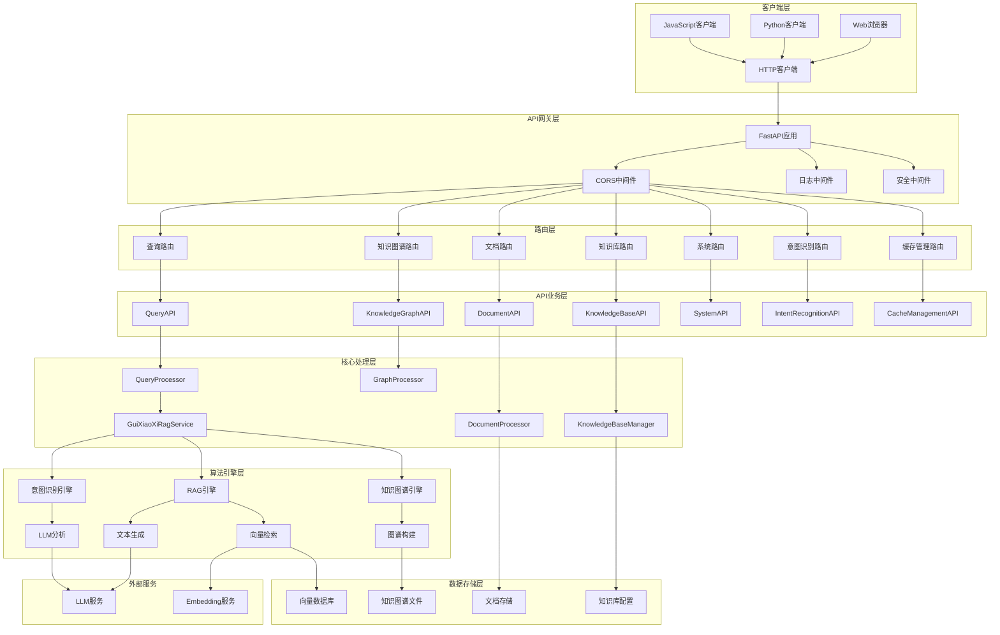
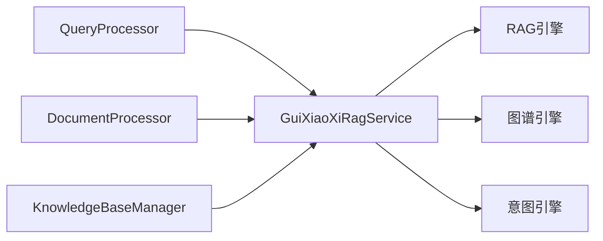
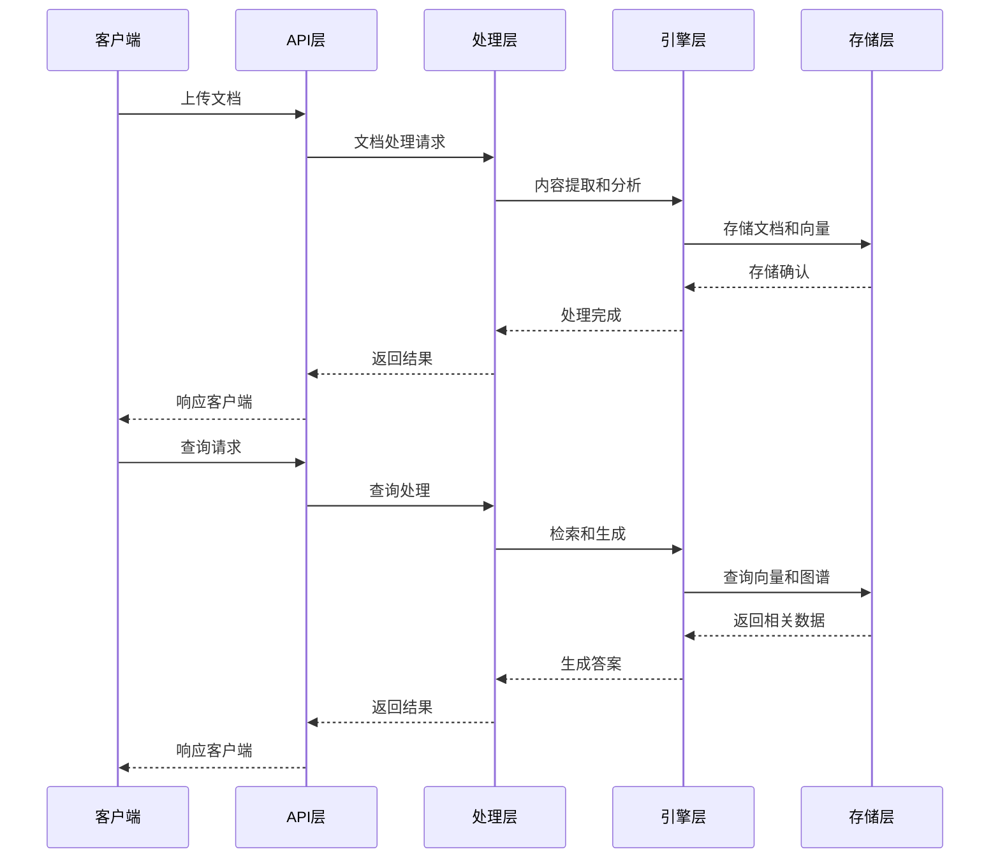
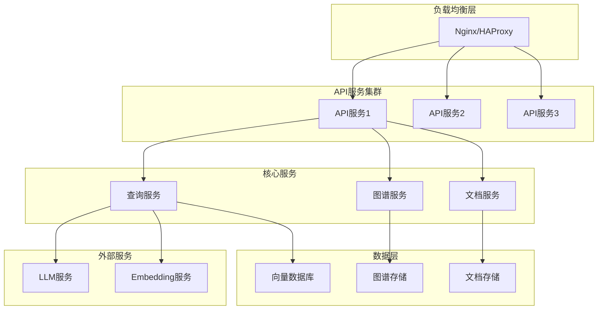

# GuiXiaoXiRag 系统架构概览

## 系统架构图



## 核心组件详解

### 1. API网关层

#### FastAPI应用 (main.py)
- **职责**: 应用入口，路由注册，全局异常处理
- **特性**: 
  - 自动API文档生成
  - 请求验证和序列化
  - 异步处理支持
  - 全局异常处理

#### 中间件系统
```python
# 中间件执行顺序
1. CORS中间件 -> 处理跨域请求
2. 安全中间件 -> 安全检查和防护
3. 日志中间件 -> 请求日志记录
4. 性能监控中间件 -> 性能指标收集
```

### 2. 路由层架构

#### 路由设计模式
```python
# 统一路由前缀: /api/v1
# 功能模块化路由设计

routers/
├── query_router.py          # /api/v1/query/*
├── document_router.py       # /api/v1/insert/*
├── knowledge_base_router.py # /api/v1/knowledge-bases/*
├── knowledge_graph_router.py# /api/v1/knowledge-graph/*
├── system_router.py         # /api/v1/system/*
├── intent_recognition_router.py # /api/v1/intent/*
└── cache_management_router.py   # /api/v1/cache/*
```

#### 路由职责分离
- **参数验证**: 使用Pydantic模型进行请求验证
- **权限检查**: 中间件层面的权限控制
- **业务委托**: 将业务逻辑委托给API处理器
- **响应格式化**: 统一的响应格式

### 3. API业务层

#### 业务处理器模式
```python
class BaseAPI:
    """API基础类"""
    def __init__(self):
        self.logger = logger_manager.setup_api_logger()
    
    async def handle_request(self, request):
        """通用请求处理模式"""
        try:
            # 1. 参数验证
            self.validate_request(request)
            
            # 2. 业务逻辑处理
            result = await self.process_business_logic(request)
            
            # 3. 结果格式化
            return self.format_response(result)
            
        except Exception as e:
            # 4. 异常处理
            return self.handle_exception(e)
```

#### API处理器职责
- **QueryAPI**: 查询逻辑处理，模式选择，结果聚合
- **DocumentAPI**: 文档处理，格式转换，内容提取
- **KnowledgeBaseAPI**: 知识库管理，配置处理
- **KnowledgeGraphAPI**: 图谱操作，数据转换
- **SystemAPI**: 系统监控，配置管理
- **IntentRecognitionAPI**: 意图分析，安全检查
- **CacheManagementAPI**: 缓存操作，性能优化

### 4. 核心处理层

#### 服务架构模式
```python
# 核心服务单例模式
class GuiXiaoXiRagService:
    _instance = None
    
    def __new__(cls):
        if cls._instance is None:
            cls._instance = super().__new__(cls)
        return cls._instance
    
    def __init__(self):
        self.rag_engine = RAGEngine()
        self.graph_engine = GraphEngine()
        self.intent_engine = IntentEngine()
```

#### 处理器协作模式


### 5. 算法引擎层

#### RAG引擎架构
```python
class RAGEngine:
    def __init__(self):
        self.retriever = VectorRetriever()
        self.generator = TextGenerator()
        self.reranker = Reranker()
    
    async def query(self, query, mode="hybrid"):
        # 1. 查询理解和增强
        enhanced_query = await self.enhance_query(query)
        
        # 2. 多模式检索
        if mode == "hybrid":
            results = await self.hybrid_retrieve(enhanced_query)
        elif mode == "local":
            results = await self.local_retrieve(enhanced_query)
        elif mode == "global":
            results = await self.global_retrieve(enhanced_query)
        
        # 3. 结果重排序
        ranked_results = await self.reranker.rerank(results)
        
        # 4. 答案生成
        answer = await self.generator.generate(query, ranked_results)
        
        return answer
```

#### 知识图谱引擎
```python
class GraphEngine:
    def __init__(self):
        self.graph_builder = GraphBuilder()
        self.graph_query = GraphQuery()
        self.graph_visualizer = GraphVisualizer()
    
    def build_graph(self, documents):
        """从文档构建知识图谱"""
        # 1. 实体识别
        entities = self.extract_entities(documents)
        
        # 2. 关系抽取
        relations = self.extract_relations(documents, entities)
        
        # 3. 图谱构建
        graph = self.graph_builder.build(entities, relations)
        
        return graph
```

#### 意图识别引擎
```python
class IntentEngine:
    def __init__(self):
        self.intent_classifier = IntentClassifier()
        self.safety_checker = SafetyChecker()
        self.query_enhancer = QueryEnhancer()
    
    async def analyze_intent(self, query, context=None):
        """分析查询意图"""
        # 1. 意图分类
        intent_type = await self.intent_classifier.classify(query)
        
        # 2. 安全检查
        safety_level = await self.safety_checker.check(query)
        
        # 3. 查询增强
        enhanced_query = await self.query_enhancer.enhance(query, intent_type)
        
        return {
            "intent_type": intent_type,
            "safety_level": safety_level,
            "enhanced_query": enhanced_query
        }
```

### 6. 数据存储层

#### 存储架构设计
```
数据存储层/
├── 向量数据库/
│   ├── 文档向量索引
│   ├── 查询向量缓存
│   └── 相似度计算结果
├── 知识图谱存储/
│   ├── GraphML文件
│   ├── JSON格式图谱
│   └── 图谱索引文件
├── 文档存储/
│   ├── 原始文档文件
│   ├── 处理后文本
│   └── 元数据信息
└── 配置存储/
    ├── 知识库配置
    ├── 系统配置
    └── 用户配置
```

#### 数据流转模式


## 系统特性

### 1. 可扩展性设计

#### 模块化架构
- **水平扩展**: 支持多实例部署
- **垂直扩展**: 支持组件独立扩展
- **插件化**: 支持自定义算法插件

#### 配置驱动
```python
# 配置驱动的组件初始化
class ComponentFactory:
    @staticmethod
    def create_llm_client(config):
        provider = config.llm_provider
        if provider == "openai":
            return OpenAIClient(config)
        elif provider == "azure":
            return AzureClient(config)
        elif provider == "ollama":
            return OllamaClient(config)
        else:
            raise ValueError(f"Unsupported provider: {provider}")
```

### 2. 性能优化

#### 缓存策略
```python
# 多层缓存架构
class CacheManager:
    def __init__(self):
        self.l1_cache = MemoryCache()      # 内存缓存
        self.l2_cache = RedisCache()       # Redis缓存
        self.l3_cache = FileCache()        # 文件缓存
    
    async def get(self, key):
        # 缓存穿透策略
        result = await self.l1_cache.get(key)
        if result is None:
            result = await self.l2_cache.get(key)
            if result is None:
                result = await self.l3_cache.get(key)
        return result
```

#### 异步处理
- **并发查询**: 支持多个查询并行处理
- **异步I/O**: 文件操作和网络请求异步化
- **流式处理**: 大文档流式处理

### 3. 可靠性保障

#### 错误处理机制
```python
# 分层错误处理
class ErrorHandler:
    @staticmethod
    def handle_api_error(error):
        """API层错误处理"""
        if isinstance(error, ValidationError):
            return {"error": "参数验证失败", "code": 400}
        elif isinstance(error, BusinessError):
            return {"error": error.message, "code": 500}
        else:
            return {"error": "系统内部错误", "code": 500}
    
    @staticmethod
    def handle_service_error(error):
        """服务层错误处理"""
        logger.error(f"Service error: {error}")
        # 错误恢复逻辑
        return None
```

#### 监控和告警
- **健康检查**: 多维度健康状态监控
- **性能监控**: 实时性能指标收集
- **日志记录**: 结构化日志记录
- **告警机制**: 异常情况自动告警

### 4. 安全性设计

#### 安全防护
```python
class SecurityMiddleware:
    async def __call__(self, request, call_next):
        # 1. 请求频率限制
        if not await self.rate_limiter.check(request):
            raise HTTPException(429, "请求过于频繁")
        
        # 2. 输入验证和清理
        cleaned_request = await self.sanitize_input(request)
        
        # 3. 安全检查
        if not await self.security_check(cleaned_request):
            raise HTTPException(403, "安全检查失败")
        
        response = await call_next(cleaned_request)
        
        # 4. 响应安全处理
        return await self.secure_response(response)
```

#### 内容安全
- **意图识别**: 识别恶意查询意图
- **内容过滤**: 过滤不当内容
- **访问控制**: 基于角色的访问控制
- **数据脱敏**: 敏感信息脱敏处理

## 部署架构

### 1. 单机部署
```yaml
# docker-compose.yml
version: '3.8'
services:
  guixiaoxirag:
    build: .
    ports:
      - "8002:8002"
    volumes:
      - ./knowledgeBase:/app/knowledgeBase
      - ./logs:/app/logs
    environment:
      - LOG_LEVEL=INFO
      - OPENAI_API_BASE=http://llm-service:8100/v1
```

### 2. 集群部署
```yaml
# kubernetes deployment
apiVersion: apps/v1
kind: Deployment
metadata:
  name: guixiaoxirag
spec:
  replicas: 3
  selector:
    matchLabels:
      app: guixiaoxirag
  template:
    metadata:
      labels:
        app: guixiaoxirag
    spec:
      containers:
      - name: guixiaoxirag
        image: guixiaoxirag:latest
        ports:
        - containerPort: 8002
        env:
        - name: LOG_LEVEL
          value: "INFO"
```

### 3. 微服务架构


## 技术选型说明

### 1. 框架选择
- **FastAPI**: 现代、高性能的Web框架
  - 自动API文档生成
  - 类型检查和验证
  - 异步支持
  - 高性能

### 2. 数据处理
- **Pydantic**: 数据验证和序列化
- **pandas**: 数据分析和处理
- **NetworkX**: 图形和网络分析

### 3. AI/ML组件
- **LightRAG**: 轻量级RAG框架
- **OpenAI**: LLM和Embedding API
- **tiktoken**: Token计算和处理

### 4. 系统工具
- **psutil**: 系统监控
- **aiofiles**: 异步文件操作
- **uvicorn**: ASGI服务器

## 最佳实践

### 1. 代码组织
- 遵循单一职责原则
- 使用依赖注入模式
- 实现接口分离
- 保持代码简洁

### 2. 性能优化
- 合理使用缓存
- 异步处理I/O操作
- 批量处理数据
- 监控性能指标

### 3. 错误处理
- 分层错误处理
- 详细错误日志
- 优雅降级
- 用户友好的错误信息

### 4. 安全考虑
- 输入验证和清理
- 访问控制
- 安全日志记录
- 定期安全审计

---

*本文档详细描述了GuiXiaoXiRag系统的整体架构设计，为开发和维护提供指导。*
